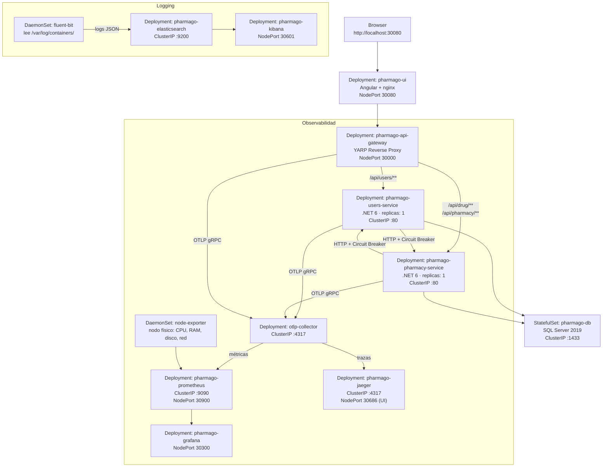

# Diagrama de Despliegue — PharmaGo en Kubernetes

## Arquitectura de componentes



## Namespace

Todos los componentes corren en el namespace `pharmago`.

## Tabla de servicios y puertos

| Componente | Tipo K8s | Puerto interno | Puerto externo (NodePort) |
|---|---|---|---|
| pharmago-ui | Deployment | 80 | 30080 |
| pharmago-api-gateway | Deployment | 80 | 30000 |
| pharmago-users-service | Deployment | 80 | — (ClusterIP) |
| pharmago-pharmacy-service | Deployment | 80 | — (ClusterIP) |
| pharmago-db | StatefulSet | 1433 | — (ClusterIP) |
| otlp-collector | Deployment | 4317, 8889 | — (ClusterIP) |
| pharmago-prometheus | Deployment | 9090 | 30900 |
| pharmago-grafana | Deployment | 3000 | 30300 |
| pharmago-jaeger | Deployment | 4317, 16686 | 30686 (UI) |
| pharmago-elasticsearch | Deployment | 9200 | — (ClusterIP) |
| pharmago-kibana | Deployment | 5601 | 30601 |
| node-exporter | DaemonSet | 9100 | — (ClusterIP) |
| fluent-bit | DaemonSet | — | — |

## Flujo de datos

### Métricas
```
Servicios .NET → OTLP gRPC → otlp-collector → Prometheus scrape :8889 → Grafana
Node Exporter → Prometheus scrape :9100 → Grafana
```

### Trazas
```
Servicios .NET → OTLP gRPC → otlp-collector → Jaeger (UI: puerto 30686)
```

### Logs
```
Servicios .NET → stdout (JSON) → Fluent Bit (DaemonSet) → Elasticsearch → Kibana (puerto 30601)
```

## Estrategia de despliegue

Todos los Deployments de microservicios usan **Rolling Update** con:
```yaml
strategy:
  type: RollingUpdate
  rollingUpdate:
    maxUnavailable: 0
    maxSurge: 1
```
Esto garantiza 0% de downtime durante actualizaciones: K8s levanta el pod nuevo antes de bajar el viejo.

## Resiliencia

- **Health probes**: todos los pods tienen `startupProbe`, `readinessProbe` y `livenessProbe` en `/health`
- **Self-healing**: si un pod falla, el Deployment controller lo reinicia automáticamente
- **Circuit Breaker**: UsersService y PharmacyService usan Polly para cortar llamadas tras 5 fallas, evitando cascading failures
